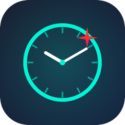

<div align="center">



# ✨ Glint

### An ambient time-awareness clock for people who lose track of time.

**Built for the distracted, the hyper-focused, and anyone who looks up and
realizes hours just vanished.** When you're deep in work — or deep in a
rabbit hole — time stops *feeling* like it's passing. Glint fixes that.

It floats above every window and every Space (like Picture-in-Picture),
ticks like a real mechanical clock, and **flashes in bold color the moment a
minute or hour changes** — so time keeps gently tapping you on the shoulder,
even when you've forgotten to look.


</div>

---

## Why Glint?

Some of us have no felt sense of time. You sit down to work, blink, and three
hours are gone — meetings missed, breaks skipped, the day eaten. A normal
clock doesn't help: it just sits there, easy to ignore. You have to *remember*
to look, and remembering is exactly the thing you can't do when you're absorbed.

Glint is **ambient time-awareness**. Instead of waiting to be checked, it
reaches out to you:

- A warm **amber → red wash** builds up over the final 10 seconds of a minute
  (a calm peripheral-vision warning that a change is coming).
- A **teal burst** flashes the whole card when the minute rolls over.
- A bigger **orange → magenta burst** + a **double chime** marks every hour —
  a clear, unmissable "an hour just passed."

You don't have to look. Glint makes you *feel* time moving — so you stay in
control of your day instead of losing it.

And inspired by [Time Timer's research](https://www.timetimer.com/pages/research)
— which finds that a *visual, number-free* depiction of remaining time improves
self-regulation and lowers anxiety — Glint can show time as a **shrinking ring
or disk** you simply watch empty, no digits to decode.

## Features

- 🪟 **Always on top, every Space** — borderless floating panel, rides over
  full-screen apps too (PiP-style).
- 🕐 **Big, glanceable face** — `H:MM` large up top, `SS` + `AM`/`PM` below,
  monospaced so it never jitters.
- 🔔 **Real tick-tock** — alternating tick (high) and tock (low) every second,
  plus chimes on the minute and hour. All sound is *synthesized in code* — no
  audio files bundled.
- 🎨 **Attention palette** — high-contrast indigo base with cyan glow, escalating
  to red as a change approaches and a bold flash at the change.
- ⏰ **Interval nudges** — pick 15 / 25 / 30 / 60 min and Glint blinks + triple-
  chimes at each mark: a deliberate "time check / take a break" tap on the
  shoulder, the heart of staying aware of your day.
- 🎯 **Focus blocks** — start a 25 or 50 min Pomodoro; a live countdown shows on
  the face and Glint celebrates with a blink + chime when the block ends.
- ⏱️ **Stopwatch** — a manual count-up timer (start / pause / resume / reset)
  shown right on the clock face.
- ⏳ **"Time sitting"** — optional readout of how long you've been at it this
  session, with a one-click reset.
- 📞 **Auto-mute in calls** — silences ticking while your mic is in use, so it
  never leaks into a meeting (no mic permission needed — it only reads device
  state).
- ⏲️ **Visual time depletion** — a shrinking **ring** around the card or a Time
  Timer-style **disk** that empties over your focus block, nudge interval, or
  the hour. You *see* time run out instead of reading digits.
- 🔴 **Time Timer Mode** — the whole face becomes a faithful Time Timer dial:
  white case, red disk depleting toward 0, a 0–55 minute ring, tick marks and a
  pointer hand. Pure, number-light, glanceable time.
- 🔢 **Number-display modes** — Full, Hide Seconds, or Hide All (pure visual,
  number-free — easiest to *feel* for time-blind users).
- 🧘 **Calm Mode** — swaps the alarm-style bursts for gentle depletion, to lower
  anxiety while still keeping you aware.
- 🎨 **Color themes** — Indigo, Midnight, Forest, Slate, Crimson.
- ⚙️ **Preferences** — 24-hour clock, three sizes, three flash intensities; all
  remembered between launches.
- 🚀 **Launch at login** — one toggle to have Glint always there.
- 🖐️ **Drag anywhere** — grab it and move it to any corner.
- 🔇 **One-click mute** & quit from the menu-bar item.
- 🪶 **Tiny & native** — pure Swift / AppKit / SwiftUI, no dependencies, no Dock
  clutter (`LSUIElement` agent app).

## The change states

| State | When | Card | Sound |
|-------|------|------|-------|
| **Calm** | `:00`–`:49` | Deep indigo, white digits, cyan glow | tick / tock |
| **Buildup** | `:50`–`:59` | Amber→red wash fades in, glow reddens, border brightens | tick / tock |
| **Minute** | minute rolls over | Teal→cyan **burst flash** | single chime |
| **Hour** | hour rolls over | Orange→magenta **burst flash** (bigger, longer) | double chime |
| **Nudge** | your chosen interval | Violet→cyan **blink** (pulses several times) | triple chime |

## Install

### Download (recommended)

1. Grab `Glint.app.zip` from the [latest release](https://github.com/salahu01/glint/releases/latest).
2. Unzip, drag **Glint.app** to `/Applications`.
3. First launch: right-click → **Open** (it's ad-hoc signed, so Gatekeeper
   asks once).

### Build from source

```bash
git clone git@github.com:salahu01/glint.git
cd glint

# Run straight away (dev):
swift run

# …or build a double-clickable app bundle:
./make-app.sh
open Glint.app          # or drag it to /Applications
```

Requires macOS 13+ and a Swift 5.9+ toolchain (Xcode 15+).

## Usage

Glint launches into the **top-right** corner. Control it from the **clock icon
in the menu bar**:

| Action | How |
|--------|-----|
| Move the clock | Drag it anywhere on screen |
| Set a time-check nudge | Menu → *Nudge Me Every* → 15 / 25 / 30 / 60 min |
| Start a focus block | Menu → *Focus Block* → Start 25 / 50 min (countdown on the face) |
| Stopwatch | Menu → *Stopwatch* → Start/Pause · Reset (count-up on the face) |
| Show / reset "time sitting" | Menu → *Show Time Sitting* · *Reset Session Timer* |
| 24-hour clock | Menu → *24-Hour Clock* |
| Size / flash strength | Menu → *Clock Size* · *Flash Intensity* |
| Color theme | Menu → *Color Theme* → Indigo / Midnight / Forest / Slate / Crimson |
| Show visual depletion | Menu → *Show Time Depletion* |
| Depletion shape | Menu → *Depletion Style* → Ring / Disk |
| Hide numerals | Menu → *Number Display* → Full / Hide Seconds / Hide All |
| Calm (low-anxiety) mode | Menu → *Calm Mode* |
| Time Timer dial | Menu → *Time Timer Mode* |
| Auto-mute during calls | Menu → *Auto-Mute in Calls* |
| Launch at login | Menu → *Launch at Login* |
| Mute / unmute ticking | Menu → *Mute Ticking* (⌘M) |
| Quit | Menu → *Quit Glint* (⌘Q) |

All preferences persist between launches.

Want it on every login? **System Settings → General → Login Items → +** → Glint.

## How it works

- **Always-on-top:** a borderless, non-activating `NSPanel` with
  `level = .floating` and
  `collectionBehavior = [.canJoinAllSpaces, .fullScreenAuxiliary, .stationary]`.
- **Tick accuracy:** the loop reschedules itself to the next whole-second
  boundary each tick, so it fires exactly when the displayed second flips — no
  drift.
- **Sound:** `AVAudioEngine` plays short PCM buffers synthesized at launch — a
  sine burst shaped by an exponential decay for the clicks, and a fundamental +
  harmonics ring for the chimes.
- **Flashes:** SwiftUI color overlays animated on `minuteTick` / `hourTick`
  counters — no window resizing, so nothing clips.

## Project layout

```
Sources/Glint/
  main.swift         Entry point — NSApplication, .accessory policy
  AppDelegate.swift  Floating panel, menu-bar item, per-second tick loop
  ClockView.swift    SwiftUI face: palette, states, flash animations
  ClockModel.swift   Observable time + mute + roll-over tick counters
  TickPlayer.swift   Synthesized tick / tock / chime audio
make-app.sh          Bundles & ad-hoc signs Glint.app
```

## Roadmap

- [x] App icon
- [x] Interval nudges (time-check every N minutes)
- [x] "Time sitting" indicator + reset
- [x] Auto-mute during meetings / calls
- [x] Preferences: sizes, 24-hour mode, flash intensity (persisted)
- [x] Launch-at-login toggle in the menu
- [x] Pomodoro / focus blocks with a visual countdown
- [x] Custom color themes
- [x] Visual time depletion — ring / disk, number-free modes, Calm Mode (Time Timer-inspired)
- [x] Notarization tooling (`notarize.sh`) — *needs a paid Apple Developer account to run*

🎉 **Roadmap complete.** The only remaining step, a fully *notarized* release,
requires an Apple Developer account ($99/yr); the script is ready —
`SIGN_ID="Developer ID Application: …" ./notarize.sh`.

## License

[MIT](LICENSE) © salahu01
